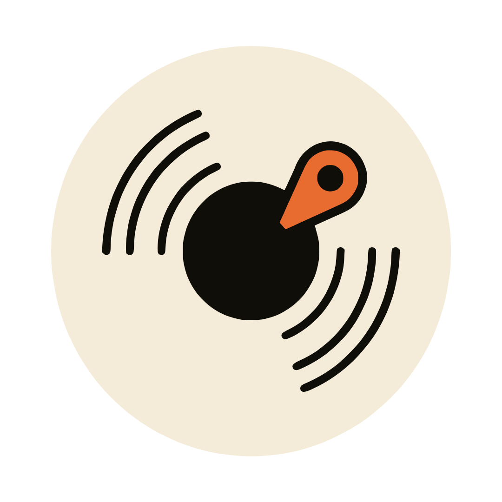

<div align="center">



# Tape

**Pin. Wave. Share.**

Timestamped music reviews shared via URL. The audio stays on your device. Only your notes travel.

<br />

<a href="https://tape.razkom.com" rel="noopener noreferrer" target="_blank" title="Open the hosted Tape app">
  
</a>

[](https://ko-fi.com/razkom)

<br />


</div>

---

## How it works

1. Drop an audio file (MP3, WAV, OGG, FLAC, M4A) onto the input pane, or tap to pick one.
2. Play the track. Tap **Pin** at any moment to drop a timestamped note. Playback keeps going while you type.
3. Drag horizontally on the waveform to scrub. Pull your finger down for finer precision (five bands, from 1x speed down to 1/16x micro).
4. When you're done, tap **Share**. Your filename and notes are compressed into the URL hash and copied to clipboard.
5. The recipient opens the link, picks the same audio file from their device, and the waveform appears with every pin in place. Tapping a pin seeks to that moment and opens the note.

---

## What you get

**Two modes, one page:** The URL hash decides which one runs. No hash means reviewer mode (upload, pin, share). A hash with encoded data means listener mode (load the matching file, see the review).

**Precision scrubbing:** Tap and drag horizontally to seek. The vertical distance between your finger and the waveform sets the speed ratio, so you can land on a specific drum hit or vocal entry without zooming. Five precision bands with on-screen feedback while you drag.

**Pin interactions:** Pins render as numbered knobs along the waveform with glowing stems. Tap a pin to seek there. The currently playing pin highlights in the notes list as the song reaches it.

**Bottom-anchored controls:** Volume slider on top with an icon that swaps through mute, low, mid, and high. Transport row below with skip back 5s, play / pause, skip forward 5s, pin, and share. Every button is at least 48 by 56 pixels for thumb use.

**URL as storage:** Notes are encoded with LZ-string compression and put in the hash fragment. Nothing is sent to a server. A typical 3 to 5 minute song with 20 to 40 notes lands well under 2 KB, which is safe to send through any chat app.

**Filename guard:** Listener mode checks that the file the recipient picks matches the filename the reviewer used. A mismatch shows an inline error so people don't review version A and listen to version B by accident.

**Offline ready:** Single HTML file with two CDN dependencies (WaveSurfer.js, LZ-string). Once cached, it works offline. Self-host it anywhere static, including a USB stick.

---

## Privacy note

The audio file never leaves the browser tab. The share link contains only the filename string and your timestamped notes. The recipient needs the same audio file on their own device to play the review. This is deliberate: it sidesteps any music licensing question that would arise from hosting tracks, and it keeps the project serverless.

If the filename itself is sensitive (something like `mix-for-label-X-final-v4.wav`), rename the file before reviewing. The string is visible in the link.

---

## Run locally

No build step required. The entire app is one HTML file with dependencies pulled from cdnjs.

```bash
git clone https://github.com/razkom/tape.git
cd tape
python3 -m http.server 8000     # or any static server
```

Open `http://localhost:8000` and drop in a track.

For development with hot reload:

```bash
npx serve .
```

---

## Hosting

Any static host works: GitHub Pages, Cloudflare Pages, Netlify, Vercel static, S3, a Raspberry Pi behind nginx. There's no backend to provision and no environment variables to set.

If you fork it for your own use, the only thing worth changing is the page title, the favicon, and the accent color (`--accent` near the top of the stylesheet).

---

## Keyboard

| Shortcut | Action |
|----------|--------|
| **Space** | Play / pause (when focus is on the page, not the textarea) |
| **Cmd / Ctrl + Enter** | Save a pin (when the comment sheet is open) |
| **Esc** | Close the bottom sheet |

---

## URL size and comment limits

Notes go in the URL hash, so the practical ceiling is the URL length your sharing channel will tolerate.

| Comment count | Approx URL size | Works in |
|---------------|-----------------|----------|
| 1 to 50 short notes | Under 1.5 KB | Everywhere, including iMessage and SMS |
| 50 to 150 mixed notes | 1.5 to 6 KB | All browsers, most chat apps |
| 150 to 500 notes | 6 to 20 KB | Browsers only, may break in chat apps |
| 500+ | 20 KB and up | Approaching browser limits (Safari caps around 80 KB) |

The share sheet displays a heads-up when the generated link crosses 6,000 characters.

---

## Limitations

- The recipient needs the original audio file. Tape doesn't host audio.
- Filename matching is strict: `Track 01.mp3` and `track-01.mp3` are treated as different files.
- The hash fragment lives in browser history, so don't paste private review links into URL bars on shared machines.
- Very long sessions with hundreds of pins will grow the link past what some chat clients accept. Trim or split when you see the warning.

---

## Stack

A single HTML file. WaveSurfer.js 7 for waveform rendering, LZ-string for compression, Pointer Events for the precision scrub gesture, and CSS custom properties for theming. Fonts are Fraunces (display) and JetBrains Mono (timestamps and labels) from Google Fonts.
